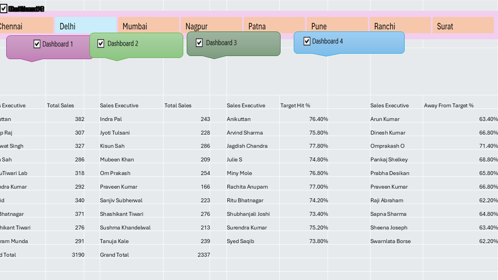

# 📊 Excel Sales Dashboard Project

This project showcases a **Sales Dashboard built in Microsoft Excel** to analyze sales performance and present key insights using **Pivot Tables, Pivot Charts, and interactive dashboard visuals**.

---

## ✅ What’s Included in This Repository

- **Excel file (main project):** `sales report 1.xlsx`
- **Dashboard screenshots:**
  - `sales_pie_chart.png`
  - `dashbord.png` *(note: filename is intentionally kept as it exists in the repo)*

---

## ✨ Key Features

- Sales data analysis in Excel
- Pivot Tables for summarization
- Pivot Charts for visualization
- Dashboard view for quick insights
- Target vs Achievement analysis

---

## 🛠 Tools Used

- Microsoft Excel
- Pivot Tables
- Pivot Charts
- Basic Excel formulas (if used in the workbook)

---

## 📂 Project File

Open the Excel workbook:

- `sales report 1.xlsx`

> Tip: Enable editing (if prompted) and use Excel desktop for best experience.

---

## 🖼 Dashboard Preview

### Sales Pie Chart

### Dashboard Screenshot

---

## 🚀 How to Use

1. Download / clone the repository.
2. Open `sales report 1.xlsx` in **Microsoft Excel (desktop)**.
3. Explore:
   - Pivot tables & charts
   - Dashboard sheet (if present)
   - Filters / slicers (if present)

---

## 📌 Notes

- If the dashboard image doesn’t display, confirm the file name matches exactly:
  - This repo contains **`dashbord.png`** (not `dashboard.png`).

---

⭐ If you find this helpful, feel free to star the repository!
