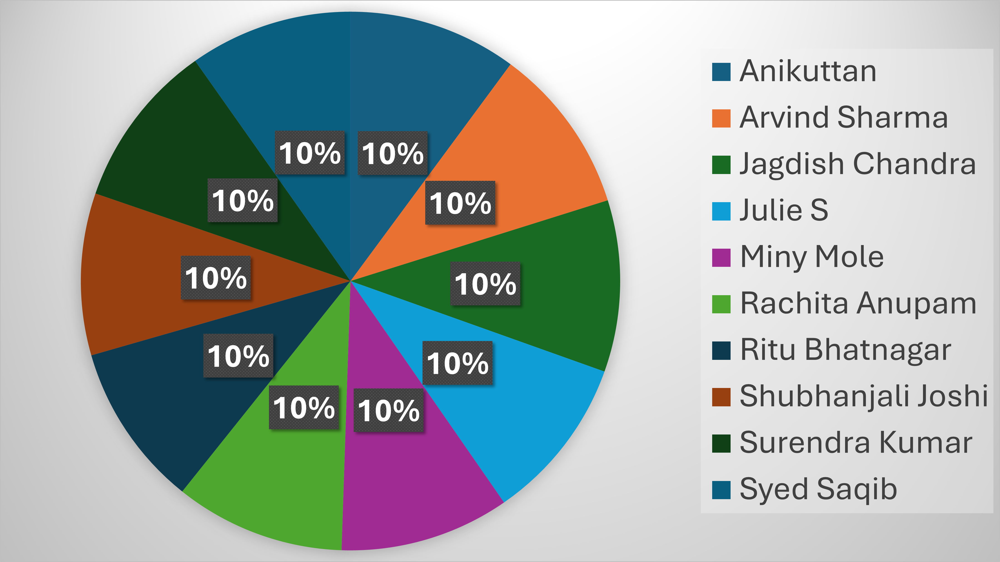

# 📊 Excel Sales Dashboard Project

This repository contains an **Excel-based Sales Dashboard** built in **Microsoft Excel** to analyze sales performance and present key insights using **Pivot Tables, Pivot Charts, and dashboard visuals**.

---

## ✅ What’s Included

- **Main Excel workbook:** `sales report 1.xlsx`
- **Dashboard images / screenshots:**
  - `sales_pie_chart.png`
  - `dashboard.png.png` *(this is the exact filename currently in the repo)*

---

## ✨ Key Features

- Sales data analysis in Excel
- Pivot Tables for summarization
- Pivot Charts for visualization
- Dashboard view for quick insights
- Target vs Achievement analysis

---

## 🛠 Tools Used

- Microsoft Excel
- Pivot Tables
- Pivot Charts
- (Optional) Excel formulas inside the workbook

---

## 📂 How to Open the Project

1. Download / clone this repository.
2. Open `sales report 1.xlsx` in **Microsoft Excel (desktop recommended)**.
3. If Excel prompts you, click **Enable Editing**.
4. Explore the dashboard sheet, pivot tables, charts, and any filters/slicers (if present).

---

## 🖼 Dashboard Preview

### Sales Pie Chart

### Dashboard Screenshot

---

## 👨‍💻 Author

**Saloni Tiwari**  
B.Sc. Data Science Student

---

## 📌 Notes

- Image links are case-sensitive and must match filenames exactly.
- This repository currently uses the filename **`dashboard.png.png`** (double `.png`).  
  If you rename it to `dashboard.png`, update the README image link accordingly.

---

⭐ If you find this project helpful, feel free to star the repository!
